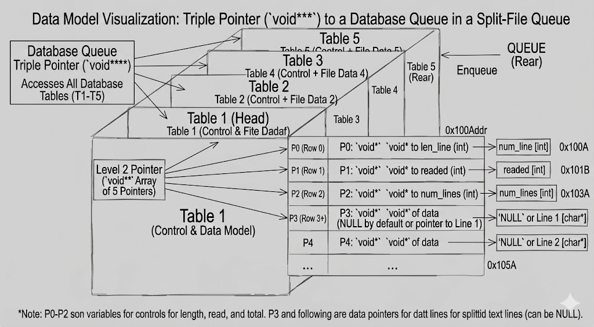

get_next_line
===

<div align="center">
	<strong><span style="font-size: 1.25em;">My implementation of the C getline function and memory analysis</span></strong>
	<br />
	<br />
	<a href="https://42.fr/en/homepage/">
		
	</a>
	<a href="https://es.wikipedia.org/wiki/C_(lenguaje_de_programaci%C3%B3n)">
		
	</a>
	<a href="https://www.gnu.org/software/make/">
		
	</a>
	<a href="https://valgrind.org/">
		
	</a>
</div>



## 📖 Overview
This was my second 42 project. It replicates **getline**: each call returns
the **next line** from a file, reading only until a full line is found and
keeping any extra bytes for the next call. The goal is to **minimize reads**
and keep the stored buffer **as empty as possible**, never reading the entire
file at once. The buffer size is **indeterminate at compile time** and is
selected with **CC options** by defining **BUFFER_SIZE**, while storage relies
on **static variables** and **malloc/free** without memory leaks. When the file
ends and nothing remains buffered, it returns **NULL**.

## ✨ Key Features
- The use of static variables.
- The scope and lifetime of static variables.
- How static variables are handled in a dependency scheme.
- File handling basics.
- What file descriptors are and how the system manages them.
- Using `open`, `read`, and `close` to manage file descriptors.
- What memory leaks are, how to detect them, and which tools are available.
- Managing an I/O system with an intermediate buffer that acts as a data store using a queue.
- Why understanding data structures matters.
- Memory linearity.
- `void` pointers and casting.

## 🧰 Requirements
```bash
# Example (Debian/Ubuntu)
sudo apt-get update
sudo apt-get install gcc
sudo apt-get install make
sudo apt-get install valgrind
```

## 👷 Build
```bash
make
```

## ▶️ Run
<h3>1) Manual build</h3>
Create a C entry file, include `get_next_line`, and compile it along with the source files under [src/](src/).

```c
#include <fcntl.h>
#include <stdio.h>
#include <stdlib.h>
#include "get_next_line.h"

int main(void)
{
	int fd = open("test.txt", O_RDONLY);
	char *line;

	if (fd < 0)
		return 1;
	while ((line = get_next_line(fd)) != NULL)
	{
		printf("%s", line);
		free(line);
	}
	close(fd);
	return 0;
}
```

```bash
cc main.c src/get_next_line.c src/get_next_line_utils.c -o gnl
```

<h3>2) Makefile tests</h3>
The repository includes a Makefile to run tests. When you run `make`, it reports which test inside [gnl_test/](gnl_test/) is used by default. You can change it and choose the test you want.

## 🧪 Memory leaks checking
```bash
valgrind --leak-check=yes --track-fds=yes ./gnl
```

## 🧭 My project approach
Because the read size is chosen at compile time with **BUFFER_SIZE**, the function must avoid infinite reads and keep the **static buffer as empty as possible** between calls. Before each `read`, it first checks the stored buffer for a newline; after `read`, it checks the newly read chunk again and only keeps what is needed for the next call. Each returned line is copied into a dedicated string that the caller must free.

The naive approach scans every line multiple times to find `\n` and to rebuild the output. My approach minimizes repeated scans by **splitting and storing lines up front** using a control structure. Since I did not use structs at the time, I modeled each file descriptor with a **table**: one control area to keep line lengths (so the newline position is known without rescanning), another to track whether the file is finished, and another to track how many lines are currently stored. This lets each line be read once, then returned by popping the **first stored line** and dispatching the queue on the next call.

The line-count control also helps **reduce reallocations**: if the table still has free slots from previously returned lines, it reuses them instead of growing the table every time.

> **Note:** 📝 Project explanation: [GNL 4D o Estructura de void](https://broken-snowdrop-f03.notion.site/GNL-4D-o-Estructura-de-void-156b80eb3d88805e9a61dadbdb7dddbb).

## ⚠️ Project conclusion: memory linearity is fast but structs are easier to manage
When I started this project I did not know how to use C structs or linked
lists. Because I wanted control variables and a custom layout, I relied on
`void` pointers and casts, but in practice it is much less complex to
structure code with **structs** and that is what they are for.

On the other hand, using `void` pointers does keep memory **linear**, which
can be faster for the CPU. In later Common Core projects I learned that C++
uses similar techniques to implement vectors internally.

For massive files, this approach is **up to 10x faster** thanks to memory
linearity, but **this function is not meant to be used** specifically for
that scenario.

> **Note:** 📝 Reddit discussion: [Why triple pointers are not convenient](https://www.reddit.com/r/C_Programming/comments/j14twn/is_it_bad_to_have_3_levels_of_pointers_if_not_how/).


## 📚 Resources

- `man getline` RTFM
- Static variables and variable scope: [UC3M course notes](https://www.it.uc3m.es/pbasanta/asng/course_notes/variables_es.html)
- Open, read, close, and file descriptor handling: [WhileTrueThenDream video](https://www.youtube.com/watch?v=MtqFZRXaeM0&ab_channel=WhileTrueThenDream)
- General project documentation: [Notion documentation](https://broken-snowdrop-f03.notion.site/Documentaci-n-122b80eb3d888057a687d4524da8d08f?pvs=74)


## 🧑‍💻 Author
- Alejandro Carrillo (alcarril) - https://github.com/alcarril
